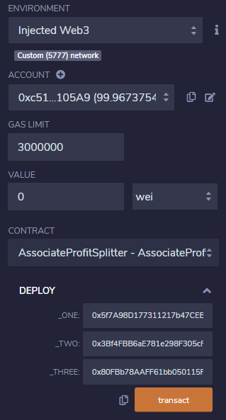
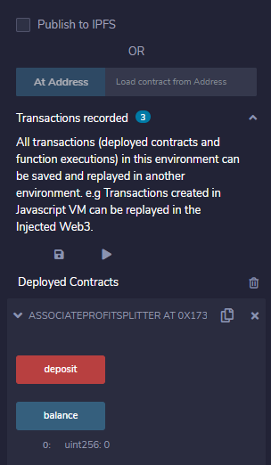
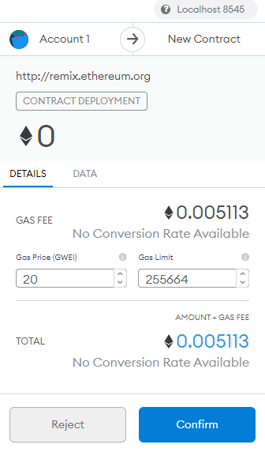

# Unit-20-Solidity

**Level One** is an `AssociateProfitSplitter` contract. This will accept Ether into the contract and divide the Ether evenly among the associate level employees. This will allow the Human Resources department to pay employees quickly and efficiently.

At the top of the contract, define the following `public` variables:

* `employee_one` -- The `address` of the first employee. Set this to `payable`.

* `employee_two` -- Another `address payable` that represents the second employee.

* `employee_three` -- The third `address payable` that represents the third employee.
  ```
      address payable employee_one;
      address payable employee_two;
      address payable employee_three;
  ```
Create a constructor function that accepts:

* `address payable _one`

* `address payable _two`

* `address payable _three`
  ```
      constructor(address payable _one, address payable _two, address payable _three) public {
          employee_one = _one;
          employee_two = _two;
          employee_three = _three;
      }
  ```
Within the constructor, set the employee addresses to equal the parameter values.

Next, create the following functions:

* `balance` -- This function should be set to `public view returns(uint)`, and must return the contract's current balance. Since we should always be sending Ether to the beneficiaries, this function should always return `0`. If it does not, the `deposit` function is not handling the remainders properly and should be fixed. This will serve as a test function of sorts.
  ```
      function balance() public view returns(uint) {
          return address(this).balance;
      }
  ```
* `deposit` -- This function should set to `public payable` check, ensuring that only the owner can call the function.

  * In this function, perform the following steps:

    * Set a `uint amount` to equal `msg.value / 3;` in order to calculate the split value of the Ether.

    * Transfer the `amount` to `employee_one`.

    * Repeat the steps for `employee_two` and `employee_three`.

    * Since `uint` only contains positive whole numbers, and Solidity does not fully support float/decimals, we must deal with a potential remainder at the end of this function since `amount` will discard the remainder during division.

    * We may either have `1` or `2` wei leftover, so transfer the `msg.value - amount * 3` back to `msg.sender`. This will re-multiply the `amount` by 3, then subtract it from the `msg.value` to account for any leftover wei, and send it back to Human Resources.
      ```
          function deposit() public payable {
              uint amount = msg.value/3;

              employee_one.transfer(amount);
              employee_two.transfer(amount);
              employee_three.transfer(amount);

              msg.sender.transfer(msg.value - amount * 3);
          }
      ```
* Create a fallback function using `function() external payable`, and call the `deposit` function from within it. This will ensure that the logic in `deposit` executes if Ether is sent directly to the contract. This is important to prevent Ether from being locked in the contract since we don't have a `withdraw` function in this use-case.
  ```
      function() external payable {
          deposit();
      }
  ```
#### Test the contract

In the `Deploy` tab in Remix, deploy the contract to your local Ganache chain by connecting to `Injected Web3` and ensuring MetaMask is pointed to `localhost:8545`.

Fill in the constructor parameters with the designated `employee` addresses.

Test the `deposit` function by sending various values. Keep an eye on the `employee` balances as you send different amounts of Ether to the contract and ensure the logic is executing properly.




### Deploy the contracts to a live Testnet

Once ready, point MetaMask to the Kovan or Ropsten network. Ensure you have test Ether on this network!

After switching MetaMask to Kovan, deploy the contracts as before and copy/keep a note of their deployed addresses. The transactions will also be in your MetaMask history, and on the blockchain permanently to explore later.


